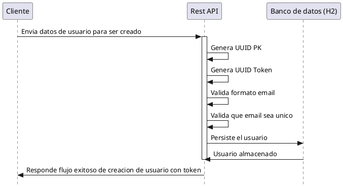

# RESTfulUserManagementJava

This is a simple REST API that allows users to create users. The API is built using Java with Spring Boot, and uses an in-memory database (H2) to store the user data.

## Requirements
- Java 17
- Spring Boot 3.2.4
- Gradle

## Database
in-memory database (H2) to store the user data. The database schema is created automatically when the application starts. The schema is defined in the file:
```
src/main/resources/schema.sql
```

## Running the API
To run the API, execute the following command in the root directory of the project:

Clean the project (optional):
```
./gradlew clean
```
Build the project: This step compiles your project and creates the executable JAR.
```
./gradlew build
```
Run the application: To start the Spring Boot application, use the bootRun command that runs the project as an application.
```
gradle bootRun
```

Run tests:
```
./gradlew test
```

## Swagger
Swagger is a tool that allows you to document and test your RESTful APIs. The Swagger UI is available at the following URL:
```http://localhost:8080/swagger-ui.html```

## Diagram


<details>
<summary>Código PlantUML (Haz clic para expandir)</summary>


</details>

## API Endpoints
The API has the following endpoints:

POST CreateUser:
```
curl --location 'http://localhost:8080/users' \
--header 'Content-Type: application/json' \
--header 'Cookie: JSESSIONID=95405CA5177132B4C5C915798EA6254A' \
--data-raw '{
    "name": "Juan Rodriguez",
    "email": "juan@gmail.cl",
    "password": "Clave123",
    "phones": [
        {
            "number": "1234567",
            "citycode": "1",
            "countrycode": "57"
        }
    ]
}'
```
PUT UpdateUser:
```
curl --location --request PUT 'http://localhost:8080/users/991428bb-11ee-4c24-a73a-eb695b943ae' \
--header 'Content-Type: application/json' \
--header 'Authorization: Bearer {tu_token_jwt}' \
--header 'Cookie: JSESSIONID=ABC5C6976B4FBE0335485956B2205D5D' \
--data '{
    "name": "kii",
    "phones": [
        {
            "number": "4444",
            "citycode": "1",
            "countrycode": "57"
        }
    ]
}'

```

GET User:
```
curl --location 'http://localhost:8080/users/d8b5972c-8d52-4fcf-a23c-05ade0940733' \
--header 'Cookie: JSESSIONID=913E9FA48D0116B2C37B6D636BD7C5D6'
```