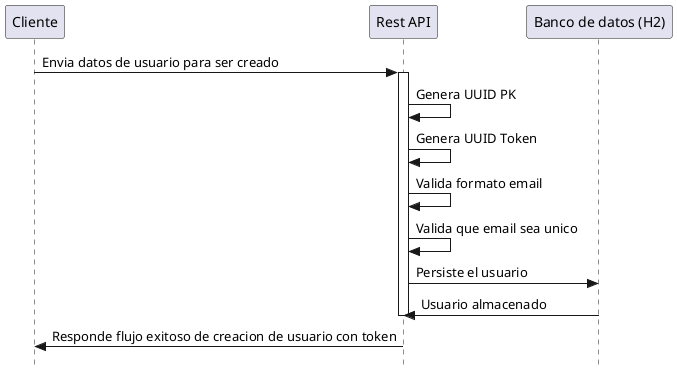

# RESTfulUserManagementJava

This is a simple REST API that allows users to create users. The API is built using Java with Spring Boot, and uses an in-memory database (H2) to store the user data.

## Requirements
- Java 17
- Spring Boot 3.2.4
- Gradle

## Database
in-memory database (H2) to store the user data. The database schema is created automatically when the application starts. The schema is defined in the file:
```
src/main/resources/schema.sql
```

## Running the API
To run the API, execute the following command in the root directory of the project:

Limpiar el proyecto (opcional):
```
./gradlew clean
```
Construir el proyecto: Este paso compila tu proyecto y crea el JAR ejecutable.
```
./gradlew build
```
Ejecutar la aplicación: Para iniciar la aplicación Spring Boot, se utilizar el comando bootRun que ejecuta el proyecto como una aplicación.
```
gradle bootRun
```

Ejecutar test:
```
./gradlew test
```

## Diagram


<details>
<summary>Código PlantUML (Haz clic para expandir)</summary>


</details>

